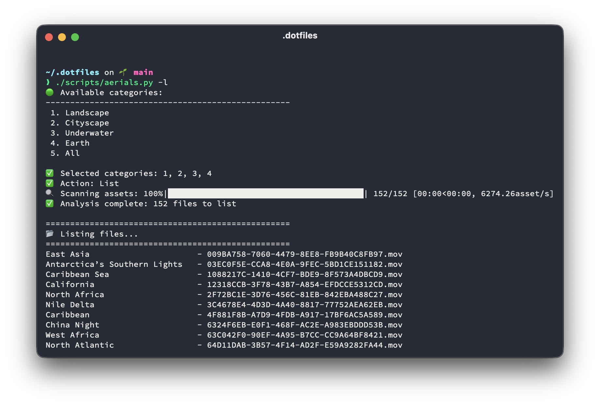

# Martim's dotfiles


This repository contains my personal dotfiles, as well as several scripts to install applications and configure settings. Although the shell configuration settings should (mostly) work on any Unix-based system, most of these scripts were only designed to run on macOS and likely won't run at all on any other OS.

Here's a short description of each script in this repository:

- [`bootstrap.sh`](bootstrap.sh) bootstrap install everything, including cloning this repository
- [`run.sh`](run.sh) install Homebrew and run all the following scripts
- [`dotsync.sh`](scripts/dotsync.sh) sync and symlink dotfiles from this repository to your home directory
- [`macos.sh`](scripts/macos.sh) configure several macOS settings
- [`aerials.py`](scripts/aerials.py) download macOS Aerial live wallpapers
- [`install.sh`](scripts/install.sh) install fonts, tools, and apps using Homebrew, [`uv`](https://docs.astral.sh/uv/), and the Mac App Store
- [`dock.sh`](scripts/dock.sh) configure macOS dock
- [`code.sh`](scripts/code.sh) install Cursor extensions
- [`local.sh`](scripts/local.sh) final local settings, like configuring git user details and registering apps using keys stored in 1Password
- [`bash_traceback.sh`](bash_traceback.sh) helper script used by other scripts to print a more helpful traceback on failure (does nothing by itself)

All these scripts are idempotent, meaning they can be run multiple times without issue.

**Warning:** Running these dotfiles blindly will overwrite settings and install apps and fonts that you probably don't need. Use at your own risk!

## Installation

On a fresh (or not so fresh) macOS install, run the following command to install Homebrew and run all scripts:

```bash
bash <(curl -s https://raw.githubusercontent.com/martimlobao/dotfiles/main/bootstrap.sh)
```

For my own convenience, I have a shorter `https://dot.lobao.io` URL that redirects to the same script. However, you probably shouldn't run arbitrary code from a stranger on the internet, so unless you're me or you fully trust me, it might be best to use the longer version.

The easier-to-remember command is:

```bash
bash <(curl -L dot.lobao.io)
```

To run the script without interactive prompts, just add `-y` to the end:

```bash
bash <(curl -sL https://dot.lobao.io) -y
```

### 1Password requirements

1Password is required to store secrets used by these scripts. These include but are not limited to:

- `op user get --me` to set your git `user.name`
- `op://Private/GitHub/email` and `op://Private/GitHub/username` to configure git and push to Github
- `op://Private/GitHub SSH Commit Signing Key/public key` to configure SSH commit signing
- `op://Private/iStat Menus 6/registered email` and `op://Private/iStat Menus 6/license key` to register iStat Menus 6
- `op://Private/Charles/registered name` and `op://Private/Charles/license key` to register Charles
- SSH keys for AWS

## Features

- Symlink dotfiles from this repository to your home directory
- Install apps, fonts, and tools using Homebrew, [`uv`](https://docs.astral.sh/uv/), and the Mac App Store
- Set up straightforward Python configuration using `uv`
- Set up macOS Dock with most used apps
- Register and configure iStat Menus 6, Charles, 1Password, AWS CLI, and GitHub CLI
- TouchID for sudo
- Configure git user details
- Configure SSH client
- Configure GPG client

## Aerial live wallpapers

This repository contains a script that downloads the wallpapers from Apple's servers and caches them to your local machine. It can also delete existing wallpapers and list all available wallpapers.

To use the script, run `uv run scripts/aerials.py` or simply `./scripts/aerials.py` (requires `uv`).



## Thanks and inspiration

Several people and repositories have contributed to or been a source of inspiration for this repository:

- [@mathiasbyens](https://mathiasbynens.be/)/[dotfiles](https://github.com/mathiasbynens/dotfiles), off of which this repository was initially based
- [@kevinsuttle](https://kevinsuttle.com/)/[macOS-Defaults](https://github.com/kevinSuttle/macOS-Defaults)
- [@ryanpavlick](https://github.com/rpavlick)/[add_to_dock](https://github.com/rpavlick/add_to_dock)
- [@mikeswanson](https://github.com/mikeswanson)/[WallGet](https://github.com/mikeswanson/WallGet)
- [@lejacobroy](https://github.com/lejacobroy)/[aerials-downloader](https://github.com/lejacobroy/aerials-downloader)
- [@br3ndonland](https://github.com/br3ndonland)/[dotfiles](https://github.com/br3ndonland/dotfiles)
- [@MichaelAquilina](https://github.com/MichaelAquilina)/[zsh-auto-notify](https://github.com/MichaelAquilina/zsh-auto-notify)
- [@Niraj-Kamdar](https://github.com/Niraj-Kamdar)/[macos-the-long-running-task-notifier](https://dev.to/kniraj/macos-the-long-running-task-notifier-35o1)
- [@ikuwow](https://github.com/ikuwow)/[dotfiles](https://github.com/ikuwow/dotfiles)
- [@kennethreitz](https://www.kennethreitz.org/)/[dotfiles](https://github.com/kennethreitz/dotfiles)
- [@br3ndonland](https://github.com/br3ndonland)/[dotfiles](https://github.com/br3ndonland/dotfiles)
- [@pablopunk](https://github.com/pablopunk)/[dotfiles](https://github.com/pablopunk/dotfiles)
- [@demophoon](https://github.com/demophoon)/[dotfiles](https://github.com/demophoon/dotfiles)
- [@lupin3000](https://github.com/lupin3000)/[macOS-defaults](https://lupin3000.github.io/macOS/defaults/)
