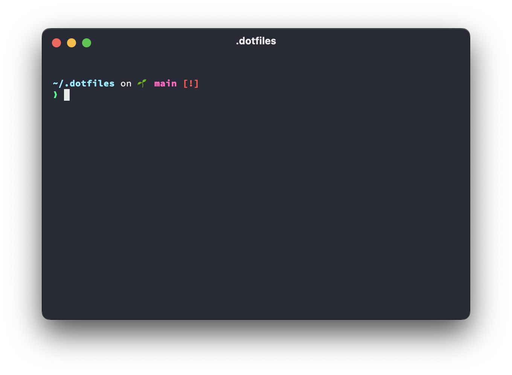

# Martim's dotfiles



This repository contains my personal dotfiles, as well as several scripts to install applications and configure settings. Although the shell configuration settings should (mostly) work on any Unix-based system, most of these scripts were only designed to run on macOS and likely won't run at all on any other OS.

Here's a short description of each script in this repository:

- `local.sh` _interactively_ configure local settings unique to each machine, like the computer name and your git user details
- `macos.sh` configure several macOS settings
- `install.sh` install fonts, tools, and apps using Homebrew, [`uv`](https://docs.astral.sh/uv/), and the Mac App Store
- `dock.sh` configure macOS dock
- `bootstrap.sh` bootstrap install everything, including cloning this repository
- `run.sh` install Homebrew and run all scripts

All these scripts are idempotent, meaning they can be run multiple times without issue.

**Attention:** Running these dotfiles blindly will overwrite settings and install apps and fonts that you probably don't need. Use at your own risk!

## Installation

On a fresh (or not so fresh) macOS install, run the following command to install Homebrew and run all scripts:

```bash
bash <(curl -L dot.lobao.io)
```

To run the script without interactive prompts, run the following command:

```bash
curl -L http://dot.lobao.io | bash -s -- --yes
```

### 1Password requirements

1Password is required to store secrets used by these scripts. These include:

- `op user get --me` to set your git `user.name`
- `op://Private/GitHub/email` and `op://Private/GitHub/username` to configure git and push to Github
- `op://Private/GitHub SSH Commit Signing Key/public key` to configure SSH commit signing
- `op://Private/iStat Menus 6/registered email` and `op://Private/iStat Menus 6/license key` to register iStat Menus 6
- `op://Private/Charles/registered name` and `op://Private/Charles/license key` to register Charles
- SSH keys for AWS

## Thanks

Several people and repositories have contributed to or been a source of inspiration for this repository:

- [@mathiasbyens](https://mathiasbynens.be/)/[dotfiles](https://github.com/mathiasbynens/dotfiles), off of which this repository was initially based
- [@kevinsuttle](https://kevinsuttle.com/)/[macOS-Defaults](https://github.com/kevinSuttle/macOS-Defaults)
- [@ryanpavlick](https://github.com/rpavlick)/[add_to_dock](https://github.com/rpavlick/add_to_dock)
- [@ikuwow](https://github.com/ikuwow)/[dotfiles](https://github.com/ikuwow/dotfiles)
- [@kennethreitz](https://www.kennethreitz.org/)/[dotfiles](https://github.com/kennethreitz/dotfiles)
- [@br3ndonland](https://github.com/br3ndonland)/[dotfiles](https://github.com/br3ndonland/dotfiles)
- [@pablopunk](https://github.com/pablopunk)/[dotfiles](https://github.com/pablopunk/dotfiles)
- [@demophoon](https://github.com/demophoon)/[dotfiles](https://github.com/demophoon/dotfiles)
